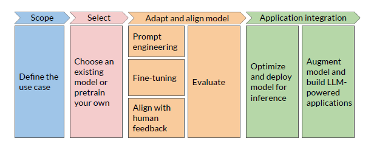

# Suggested Learning Resources

## Contents

- [LLM](#llm)
- [App Development](#app-development)
- [Quality](#quality)
- [Introductory courses to Vector DBs](#introductory-courses-to-vector-dbs)
- [Additional resources](#additional-resources)

To effectively integrate Large Language Models (LLMs) into app development, it's crucial to have a solid understanding of LLMs. Therefore, this section presents a list of learning resources. For optimal learning, it is advised to pursue the courses in the sequence provided below.

## LLM

- For an amazing introductory course on LLMs, check out the DeepLearning.AI course [Generative AI with Large Language Models (20+h) ](https://www.coursera.org/learn/generative-ai-with-llms). This course provides a strong foundation in understanding LLMs, including the Attention Is All You Need algorithm, language model workings, embedding, and the challenges with Large Language Models. It also covers finetuning strategies and how smaller fine-tuned models can achieve comparable or even better results than large models.
    
    
    *Attention Is All You Need algorithm*

    Course also dives into Generative AI project lifecycle.
    
    
    *Generative AI project lifecycle*

- If you prefer a shorter introduction, you can watch the [Intro to Large Language Models (1h) ](https://www.youtube.com/watch?v=zjkBMFhNj_g) video.

## App Development

> DeepLearning.AI is often recomened in this section. DeepLearning.AI is led by a team of instructors from Stanford University and deeplearning.ai, offers a comprehensive platform for learning AI development. They provide a wide range of courses, specializations, and professional certificates.

- Prompt engineering refers to the practice of crafting and optimizing input prompts by selecting appropriate words, phrases, sentences, punctuation, and separator characters to effectively use LLMs for a wide variety of applications. In other words, prompt engineering is the art of communicating with an LLM.  Refer to these resources to learn more about prompt engineering:
    - [ChatGPT Prompt Engineering for Developers (2h) ](https://learn.deeplearning.ai/chatgpt-prompt-eng)
    - [Prompt Engineering ](https://platform.openai.com/docs/guides/prompt-engineering) article from OpenAI are recommended resources for learning prompting techniques.
- There are two main approaches to send prompts to LLM:
    - Leveraging API libraries
    - Using SDKs/Frameworks that utilize API libraries
    
    We will review API libs and SDKs/Frameworks later in this document but for now complete some of the following courses to get a better understanding how to send prompts to LLMs:

    - [LangChain for LLM Application Development (2h) ](https://learn.deeplearning.ai/langchain/) provides insights into using LangChain for LLM development.
    - [LangChain Chat with Your Data (2h) ](https://learn.deeplearning.ai/langchain-chat-with-your-data/) is a course that demonstrates the use of LangChain for the RAG pattern.
    - [How Business Thinkers Can Start Building AI Plugins With Semantic Kernel (2h) ](https://learn.deeplearning.ai/microsoft-semantic-kernel/) introduces Semantic Kernel (SK) and provides guidance on building AI plugins with it.

### Quality.

Verifying the quality of responses generated by LLMs in applications is an emerging area in software development. The courses listed below offer valuable insights into this process:

- [Evaluating and Debugging Generative AI (2h) ](https://learn.deeplearning.ai/evaluating-debugging-generative-ai) is a course that explains how to use LLM to validate responses.
- [Quality and Safety for LLM Applications (2h) ](https://learn.deeplearning.ai/quality-safety-llm-applications/) another great quality and safety of outputs. 

### Introductory courses to Vector DBs.
- [Advanced Retrieval for AI with Chroma (2h) ](https://learn.deeplearning.ai/advanced-retrieval-for-ai/)
- [Vector Databases: from Embeddings to Applications (2h) ](https://learn.deeplearning.ai/vector-databases-embeddings-applications/) - utilizes Weaviate

For more great courses on LLMs, visit [DeepLearning.AI Short Courses ](https://learn.deeplearning.ai/). DeepLearning.AI constantly adds new courses, so it is recommended to check back often. As of the beginning of 2024, DeepLearning.AI remains one of the foundational sources for learning about LLMs and app development leveraging LLMs.

### Additional resources

- [LangChain Course ](https://www.youtube.com/playlist?list=PLqZXAkvF1bPNQER9mLmDbntNfSpzdDIU5): A comprehensive course exposing interesting patterns, although code samples could be outdated.
- [Develop Generative AI solutions with Azure OpenAI Service ](https://learn.microsoft.com/en-gb/training/paths/develop-ai-solutions-azure-openai/): Light courses from Microsoft.
- Short but very saturated videos on Azure Open AI:
    - [Introduction to Azure OpenAI and Architecture Patterns ](https://www.youtube.com/watch?v=TI85JJVPnrM)
    - [Azure OpenAI Chat With Your Data No Code Edition ](https://www.youtube.com/watch?v=tFJNasjGM3E)